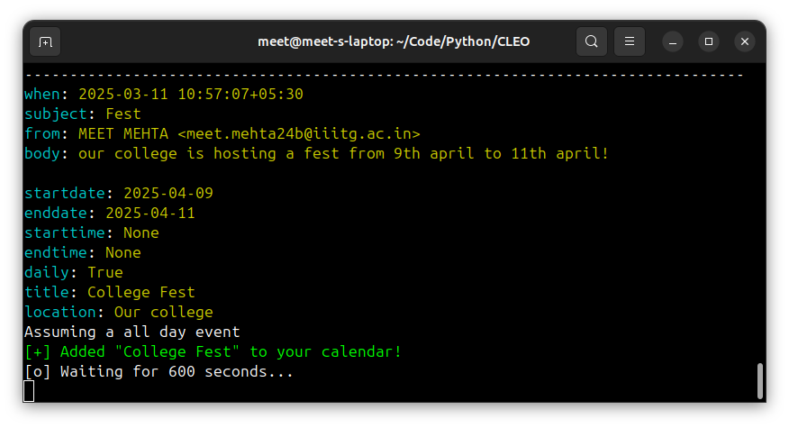
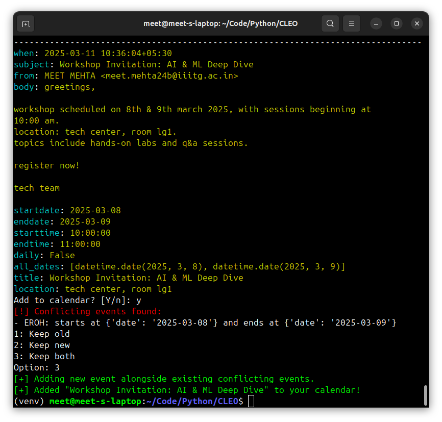

# CLEO - Smart Email & Calendar Assistant

CLEO is a command-line tool designed to streamline your inbox by reading your emails, extracting key event details, and automatically updating your Google Calendar. 

## ✅ Project Targets

- [x] **OAuth Authentication:**  
  - Secure, browser-based OAuth login for Gmail & Calendar.
  - Local token storage to avoid repeated logins.

- [x] **Email Fetching:**  
  - Fetching emails from Gmail using the Google API.

- [x] **Date Extraction:**  
  - handling various date formats (e.g., "Friday 7th", "20 May 2024", "7/3/2024", "02/05/2025").

- [x] **Multi-Date Events**
  - handling events that span multiple days

- [x] **Calendar Syncing:**  
  - Automatically create and update Google Calendar events based on extracted email data.

- [x] **Location Extraction:**  
  - Detect venues (street addresses), internal room codes (e.g., "C7", "LG1") using custom regex or spaCy’s EntityRuler.
  - Explore integrating Google Maps API.

- [ ] **Event Title Extraction:**  
  - Capture event titles from email subjects and contextual clues in the body.

- [ ] **Additional NLP Integration:**  
  - Experiment with a small LLM (e.g., DistilBERT) to enhance extraction of nuanced details.

- [ ] **User Interface Enhancements:**  
  - Expand CLI commands for summarizing emails, listing upcoming events, and manual syncing.

- [ ] **Web Application/Website:**

  - Develop a web-based interface for CLEO to allow users to access its features through a browser.
  - Create a user-friendly dashboard to view emails, event details, and calendar sync status.
  - Integrate authentication, email fetching, and event creation in a responsive design.
  - Include map integration for visualizing event locations.

### Stay Organized, Effortlessly with CLEO! 

## CLEO in Action!

Here’s a normal run of CLEO extracting details from an email and syncing to the calendar:

_Description:_ In this screenshot, CLEO extracts the event date, time, and location from a single-day email, then confirms whether the user wants to add it to their calendar.

Here’s a quick look at CLEO parsing multi-day events and adding them to the calendar:

And here’s an example of how CLEO handles conflicting events:

